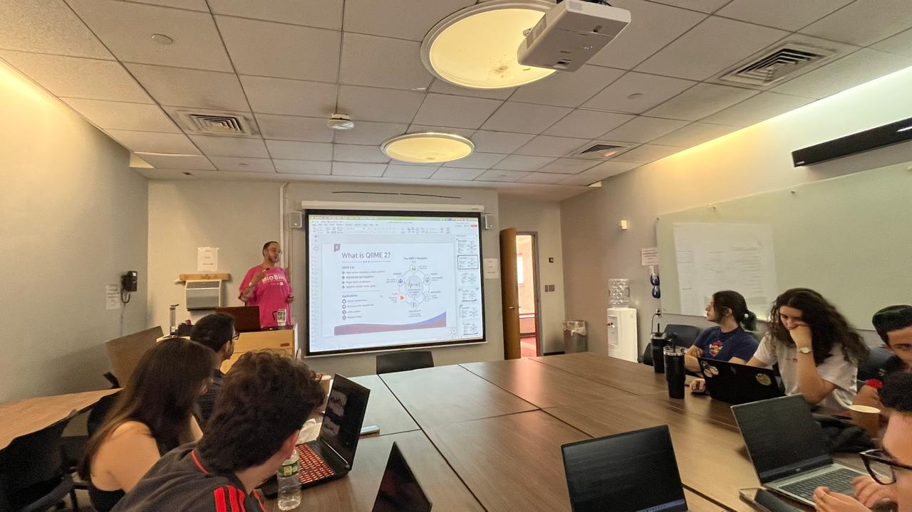
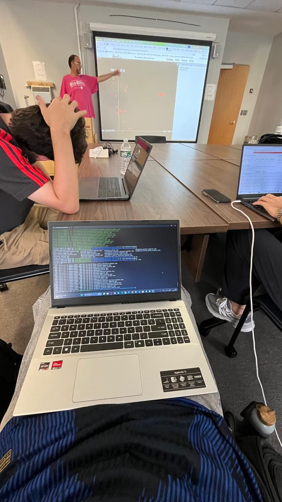
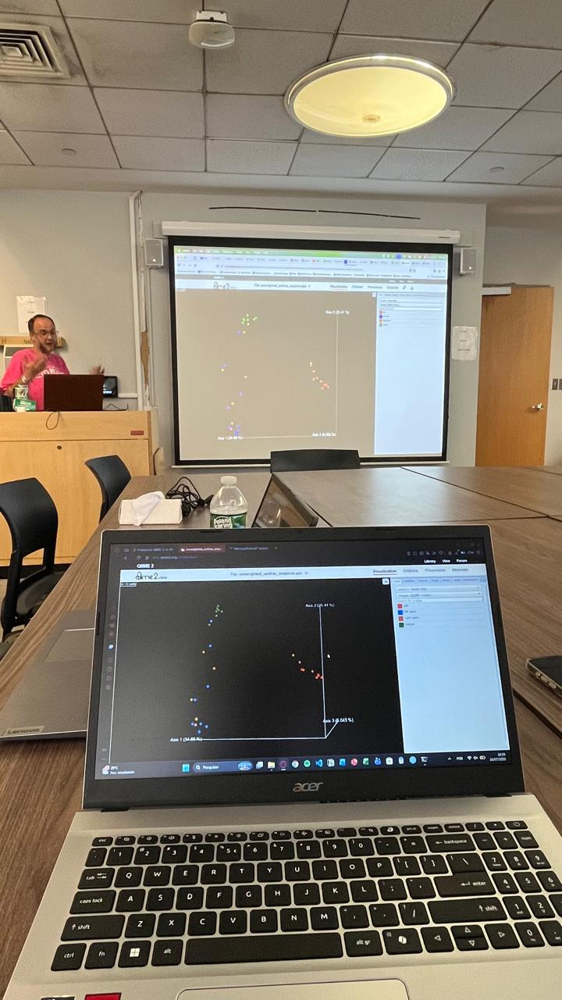
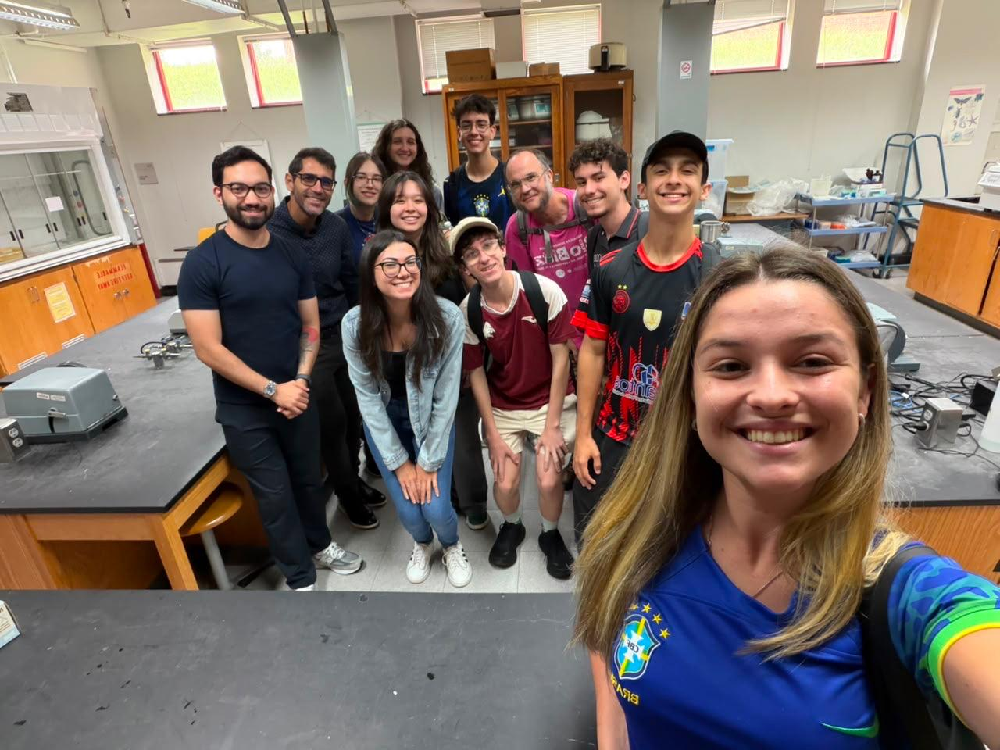

# QIIME 2 Genome Data Analysis

A step-by-step, reproducible walkthrough of the QIIME 2 **"Moving Pictures"** tutorial, run entirely on **Windows 11 via WSL (Windows Subsystem for Linux)**. This repository documents the full 16S rRNA amplicon analysis pipeline: from raw multiplexed sequencing reads to diversity metrics, taxonomy, and differential abundance testing.

> 🎓 **Academic context:** This project was completed during my academic mobility exchange in the United States as part of the **"Talentos Paraná no Mundo"** program (Paraná Talents Around the World), an international exchange program for Paraná state university students. The analysis was done as a guided, hands-on tutorial during a bioinformatics class, where the instructor walked through the pipeline live and students followed along executing each command themselves. This was my first hands-on introduction to Linux command-line workflows, conda environments, and microbiome bioinformatics.

## Table of Contents

- [About the Dataset](#about-the-dataset)
- [Pipeline Overview](#pipeline-overview)
- [Environment Setup](#environment-setup)
  - [1. Install WSL + Ubuntu](#1-install-wsl--ubuntu)
  - [2. Install Miniconda](#2-install-miniconda)
  - [3. Create the QIIME 2 conda environment](#3-create-the-qiime-2-conda-environment)
- [Running the Analysis](#running-the-analysis)
- [Repository Structure](#repository-structure)
- [Viewing Results (.qzv files)](#viewing-results-qzv-files)
- [What I Learned](#what-i-learned)
- [Acknowledgments](#acknowledgments)
- [License](#license)

## About the Dataset

The tutorial uses a real published human microbiome dataset from **Caporaso et al. (2011)**, consisting of samples from **two subjects**, **four body sites** (gut, tongue, left palm, right palm), and **five timepoints**, the first of which immediately followed antibiotic usage. Sequencing was done on an Illumina HiSeq using the Earth Microbiome Project (EMP) V4 16S rRNA protocol.

This is one of the most widely used introductory datasets in the QIIME 2 ecosystem, ideal for learning the full amplicon analysis workflow end-to-end.

Official tutorial reference: [QIIME 2 "Moving Pictures" tutorial](https://docs.qiime2.org/2024.10/tutorials/moving-pictures/)

## Pipeline Overview

```
Raw multiplexed reads (barcodes.fastq.gz + sequences.fastq.gz)
        │
        ▼
 Import into QIIME 2 artifact (.qza)
        │
        ▼
 Demultiplexing (split reads by sample)
        │
        ▼
 Quality control / denoising (DADA2)  →  Feature table + representative sequences
        │
        ▼
 Phylogenetic tree construction (MAFFT + FastTree)
        │
        ▼
 Alpha & beta diversity analysis + statistical tests + rarefaction
        │
        ▼
 Taxonomic classification (Naive Bayes classifier) + taxa bar plots
        │
        ▼
 Differential abundance testing (ANCOM-BC)
```

Each stage of this pipeline corresponds to one script in the [`scripts/`](./scripts) folder (see [Repository Structure](#repository-structure)).

## Environment Setup

This project was run using the following stack:

```
Windows 11 → WSL2 → Ubuntu → Miniconda → Conda environment → QIIME 2
```

### 1. Install WSL + Ubuntu

Open PowerShell **as Administrator** and run:

```powershell
wsl --install
```

This installs WSL2 with Ubuntu as the default distribution. Restart your computer if prompted, then launch "Ubuntu" from the Start Menu and finish creating your Linux username/password.

Update packages inside Ubuntu:

```bash
sudo apt update && sudo apt upgrade -y
```

### 2. Install Miniconda

Inside your WSL Ubuntu terminal:

```bash
wget https://repo.anaconda.com/miniconda3/Miniconda3-latest-Linux-x86_64.sh -O miniconda.sh
bash miniconda.sh -b -p $HOME/miniconda3
source $HOME/miniconda3/bin/activate
conda init bash
```

Close and reopen your terminal (or run `source ~/.bashrc`) so the `conda` command becomes available.

### 3. Create the QIIME 2 conda environment

QIIME 2 provides an official environment file for each release. This project uses the **2024.10 amplicon distribution**:

```bash
wget https://data.qiime2.org/distro/amplicon/qiime2-amplicon-2024.10-py310-linux-conda.yml
conda env create -n qiime2-amplicon-2024.10 --file qiime2-amplicon-2024.10-py310-linux-conda.yml
rm qiime2-amplicon-2024.10-py310-linux-conda.yml
```

Activate the environment (needed every time you open a new terminal):

```bash
conda activate qiime2-amplicon-2024.10
```

Verify the install:

```bash
qiime --help
```

If you see the QIIME 2 command list, you're ready to go.

## Running the Analysis

Clone this repository, then move into it:

```bash
git clone https://github.com/<your-username>/QIIME2_genome_data_analysis_project.git
cd QIIME2_genome_data_analysis_project
conda activate qiime2-amplicon-2024.10
```

Create a working directory for the data and outputs (kept out of version control — see `.gitignore`):

```bash
mkdir -p data
```

Then run the scripts **in order**. Each one is commented and mirrors one stage of the pipeline described above.

| Step | Script | What it does |
|------|--------|---------------|
| 1 | `scripts/01_download_data.sh` | Downloads sample metadata and raw multiplexed reads via `wget` |
| 2 | `scripts/02_import_and_demux.sh` | Imports raw reads into a QIIME 2 artifact and demultiplexes them per sample |
| 3 | `scripts/03_denoise_dada2.sh` | Runs DADA2 denoising to produce a feature table + representative sequences |
| 4 | `scripts/04_phylogeny.sh` | Builds a phylogenetic tree (MAFFT alignment + FastTree + midpoint rooting) |
| 5 | `scripts/05_diversity_analysis.sh` | Computes alpha/beta diversity metrics, group significance tests, and rarefaction curves |
| 6 | `scripts/06_taxonomy.sh` | Assigns taxonomy with a pre-trained Naive Bayes classifier and builds taxa bar plots |
| 7 | `scripts/07_differential_abundance.sh` | Runs ANCOM-BC differential abundance testing on gut samples |

You can run all of them sequentially with:

```bash
bash scripts/run_all.sh
```

> ⚠️ Step 3 (DADA2 denoising) can take several minutes depending on your machine — it's the slowest step in the pipeline.

## Repository Structure

```
qiime2-moving-pictures-analysis/
├── README.md
├── LICENSE
├── pictures/class-pictures
    ├── alfa-beta-analysis-picture.jpeg
    ├── command-line-picture.jpeg
    ├── group-professor-picture.jpeg
    ├── qime2-introduction-picture.jpeg
├── .gitignore
└── scripts/
    ├── 01_download_data.sh
    ├── 02_import_and_demux.sh
    ├── 03_denoise_dada2.sh
    ├── 04_phylogeny.sh
    ├── 05_diversity_analysis.sh
    ├── 06_taxonomy.sh
    ├── 07_differential_abundance.sh
    └── run_all.sh
```

Data files (`.qza`, `.qzv`, `.fastq.gz`, the classifier, etc.) are **not versioned** in this repository — they are all fetched or generated by the scripts above into a local `data/` folder, which is excluded via `.gitignore`. This keeps the repo lightweight while remaining fully reproducible.

## Viewing Results (.qzv files)

QIIME 2 visualizations (`.qzv` files) are not readable directly — they need to be opened either with:

- **QIIME 2 View** (no installation needed): drag and drop your `.qzv` file at [https://view.qiime2.org](https://view.qiime2.org), or
- The command line, from inside your conda environment:

```bash
qiime tools view data/demux.qzv
```

## What I Learned

This project was my introduction to several concepts that I built on for later coursework:

- Setting up and navigating a **Linux environment via WSL** on Windows
- Managing isolated software environments with **conda**
- The general **amplicon sequencing bioinformatics workflow**: demultiplexing, denoising/OTU-picking, phylogenetics, diversity metrics, taxonomic classification, and differential abundance testing
- Reading and interpreting **interactive scientific visualizations** (Emperor PCoA plots, rarefaction curves, taxa bar plots)
- Basic **statistical testing** applied to biological data (PERMANOVA, Kruskal-Wallis-based group significance)

## Class Pictures
<div align="center">
  
  <p style="margin-top: 5px; font-size: 0.85em; color: #888;">
    <i>QIIME2 Introduction Class</i>
  </p>
</div>

<div align="center">
  
  <p style="margin-top: 5px; font-size: 0.85em; color: #888;">
    <i>Data Analysis Executed Directly Via Command Line</i>
  </p>
</div>

<div align="center">
  
  <p style="margin-top: 5px; font-size: 0.85em; color: #888;">
    <i>Alpha and Beta Diversity Analysis</i>
  </p>
</div>

<div align="center">
  
  <p style="margin-top: 5px; font-size: 0.85em; color: #888;">
    <i>Biology Lab Tour - College of Staten Island</i>
  </p>
</div>

## Acknowledgments

- Special thanks to Professor Seth Wollney, faculty member at the College of Staten Island, for teaching the bioinformatics class and introducing the QIIME 2 workflow used in this project.
- This analysis follows the official [QIIME 2 "Moving Pictures" tutorial](https://docs.qiime2.org/2024.10/tutorials/moving-pictures/) (QIIME 2 development team).
- Dataset originally published in Caporaso et al., *"Moving pictures of the human microbiome"*, Genome Biology (2011).
- Completed as part of a bioinformatics class during my academic mobility exchange under the **Paraná Talents Around the World** program.

## License

This repository is licensed under the [MIT License](./LICENSE) — the tutorial content and dataset itself remain the property of the QIIME 2 development team and original study authors, referenced above.
